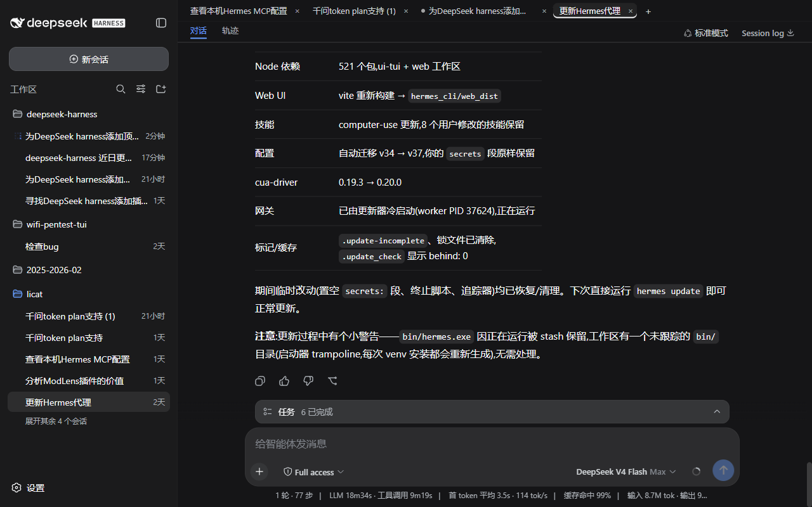
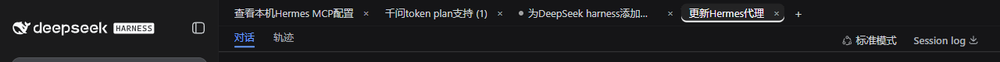
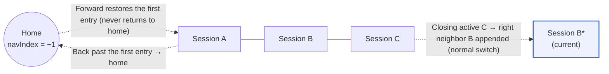
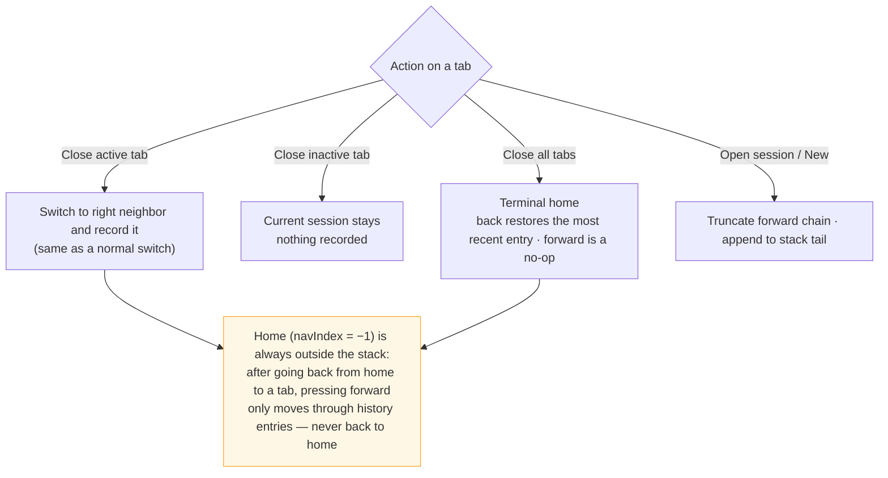

# dsh-session-tabs

English ｜ [中文](README.md)

A browser-style session tab bar for DeepSeek Harness (DSH): every session you open gets a top tab — click to switch, close per tab, start new sessions, just like a browser. The current session is highlighted and its running state is visible at a glance.

## Screenshots





## Tab history navigation

The tab history is an **activation log**: every switch (clicking a tab, closing the active tab, creating a session) truncates the forward chain and appends the current session to the stack tail. Closing a tab only removes its entry from the strip — it is **not** deleted from the history, so going back onto a closed tab reopens it.



What each action does:



## Relationship to the existing layout

The tab bar sits **beside the sidebar** (a `position: fixed` top bar starting at the sidebar's right edge) and **does not squeeze the sidebar**:

- The sidebar column stays in place (draggable 264–420px; the bar follows automatically when collapsed to the 56px rail);
- Only the center column's content is pushed down 34px to make room;
- Theme-aware: uses DSH theme tokens (`--dsw-alias-*`), adapts to light/dark automatically.

## Features

- One tab per opened session (MRU, in open order)
- Current session highlighted (brand underline, `data-active`)
- Status dot: running (brand pulse) / awaiting interaction (amber) / completed (green)
- × Close tab:
  - Closing the **active** tab is a normal switch — it jumps to the **right neighbor tab** (the left one when the closed tab was rightmost) and is recorded into the tab history like any switch;
  - Closing an **inactive** tab: the current session stays, **nothing is recorded** (a closed session can still be restored by going back through the history);
  - Closing the **last** tab enters the home state (no session selected): back restores the most recent history entry, forward is a no-op.
- Middle mouse button: on a tab = close that tab; on a sidebar session row = open it as a background tab (without switching the current session)
- Side mouse buttons: browser-style session history navigation — back/forward move one entry at a time (landing on a closed tab reopens it); home is special: after going back from home to a tab, forward **never** returns to home
- ＋ New session (`workspaces.startSession()`)
- Horizontal scrolling when tabs overflow (scrollbar hidden)
- Pure client-side implementation: no Host dependency, no persistent writes

## Installation (deployment-level, auto-loads after refresh)

```sh
dsh plugin --profile web add ./dsh-session-tabs
```

(The path is relative to the directory you run the command from — point it at your checkout.)

Or manually: add the dependency to the profile's `package.json` and insert the row into `cordis.patch.yml`:

```yaml
- insert:
    - id: dsh-session-tabs
      name: dsh-session-tabs
```

Then run `pnpm install` and restart DSH (or trigger the profile patch hot-reload and refresh the page). After that the tab bar appears automatically on every page load — no approval, no manual activation.

## Quick start

1. Refresh the page (or restart DSH): the tab bar appears at the top and the current session becomes a tab;
2. Open more sessions: click a sidebar session row (open in foreground) or **middle-click** it (open as a background tab without switching); click `＋` on the bar for a new session;
3. Switch by clicking a tab; close via its `×` or a **middle-click** on the tab;
4. History navigation: mouse **side buttons** for back/forward (browser-style, see [Tab history navigation](#tab-history-navigation)).

## Uninstall

```sh
dsh plugin --profile web remove dsh-session-tabs
```

Refresh the page afterwards — the tab bar disappears (the plugin never writes anything persistent, so no extra cleanup is needed).

## Compatibility

| Item | Value |
| --- | --- |
| Supported DSH versions | First npm release `0.0.1-rc.1` (`@deepseek-ai/dsh-base`, 2026-08-10) → mainline `0.1.0-rc.7` (Git `99f6f02fec`, 2026-08-17) |
| Last verified | 2026-08-18 |
| Versions actually tested | npm `0.1.0-rc.6` via the official `npx @deepseek-ai/dsh web` command (load/tabs/switch/close/side-button navigation all pass); mainline `0.1.0-rc.7` full feature pass |
| Verification coverage | load/unload, tab switching, closing active/inactive/all tabs, middle-click close and background open, side-button back/forward, archived-tab cleanup, light/dark themes |
| Interface dependencies | `shell.overlay` slot standard props (`useSessions`/`useWorkspaces`), `sessions.open`/`sessions.clear`, `workspaces.startSession` |
| Configuration | none (pure client, no Config) |

Compatibility rationale: the plugin only uses public interfaces that have been stable since the first release (slot standard props and public sessions/workspaces methods). Note that the `0.0.1-rc.1` npm package itself has a missing dependency (`@deepseek-ai/dsh-agent-tool-mode` was never published) and cannot be installed, so that version is covered by interface compatibility; the first installable npm version, `0.1.0-rc.6`, is real-machine tested. DSH mainline evolves quickly and old results can go stale. If you hit an issue on a newer version, file an issue with your DSH version and commit.

## Permissions & data

- **Pure client-side**: no Host code is injected, no Host dependency, no persistent writes;
- **Reads**: session list and selection (`useSessions`), archived set (`useWorkspaces`), plus calls to `sessions.open`/`sessions.clear`/`workspaces.startSession` — all public DSH interfaces; the data is used only to render tabs and navigate;
- **No network, no credentials, no file access**; the tab order and nav history live only in the current page's memory and reset on refresh.

## Troubleshooting

| Symptom | Fix |
| --- | --- |
| Tab bar does not appear | Check the profile dependency is installed (`pnpm install`) and `cordis.patch.yml` has the insert row; after the patch hot-reload, **hard-refresh** the page |
| Tab titles look stale | Archived/renamed sessions re-align on refresh (the tab MRU follows the session list) |
| Tab bar is misplaced | Check for other plugins injecting into `shell.overlay` (multiple occupants are ordered by `order`) |
| Side buttons trigger browser history navigation | Confirm the latest bundle is loaded (deployment plugins load with the page — hard-refresh once) |

## Development notes

- `lib/client.js` is a browser bundle in `__ModuleLoader__.load` format (same as installed community plugins), loaded by the web shell's module system through `exports["./client"]`;
- `package.json` declares `dsh.client` (`platform: 'web'`);
- The only dependencies are `react` (shell seed) and the Cordis runtime; `sessions.clear()` (clearing the current selection into the no-session view state) is used only when the last tab is closed.

## License

MIT