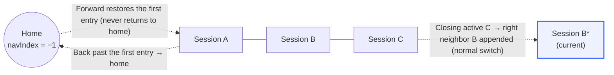
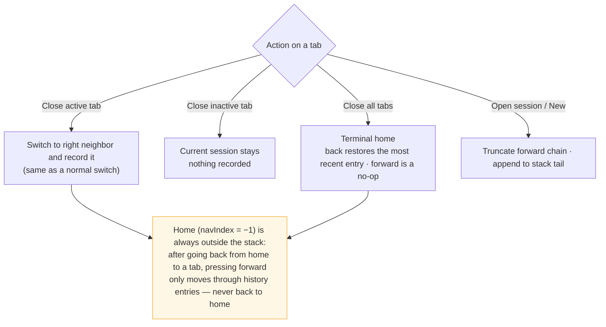

# dsh-session-tabs

English ｜ [中文](README.md)

A browser-style session tab bar for DeepSeek Harness (DSH): every session you open gets a top tab — click to switch, close per tab, start new sessions, just like a browser. The current session is highlighted and its running state is visible at a glance.

## Screenshots


## Tab history navigation

The tab history is an **activation log**: every switch (clicking a tab, closing the active tab, creating a session) truncates the forward chain and appends the current session to the stack tail. Closing a tab only removes its entry from the strip — it is **not** deleted from the history, so going back onto a closed tab reopens it.



What each action does:



## Relationship to the existing layout

The tab bar sits **beside the sidebar** (a `position: fixed` top bar starting at the sidebar's right edge) and **does not squeeze the sidebar**:

- The sidebar column stays in place (draggable 264–420px; the bar follows automatically when collapsed to the 56px rail);
- Only the center column's content is pushed down 34px to make room;
- Theme-aware: uses DSH theme tokens (`--dsw-alias-*`), adapts to light/dark automatically.

## Features

- One tab per opened session (MRU, in open order)
- Current session highlighted (brand underline, `data-active`)
- Status dot: running (brand pulse) / awaiting interaction (amber) / completed (green)
- × Close tab:
  - Closing the **active** tab is a normal switch — it jumps to the **right neighbor tab** (the left one when the closed tab was rightmost) and is recorded into the tab history like any switch;
  - Closing an **inactive** tab: the current session stays, **nothing is recorded** (a closed session can still be restored by going back through the history);
  - Closing the **last** tab enters the home state (no session selected): back restores the most recent history entry, forward is a no-op.
- Middle mouse button: on a tab = close that tab; on a sidebar session row = open it as a background tab (without switching the current session)
- Side mouse buttons: browser-style session history navigation — back/forward move one entry at a time (landing on a closed tab reopens it); home is special: after going back from home to a tab, forward **never** returns to home
- ＋ New session (`workspaces.startSession()`)
- Horizontal scrolling when tabs overflow (scrollbar hidden)
- Pure client-side implementation: no Host dependency, no persistent writes

## Installation (deployment-level, auto-loads after refresh)

```sh
dsh plugin --profile web add D:\Project\2025-2026-02\dsh-session-tabs
```

(The path above is an example — point it at your checkout.)

Or manually: add the dependency to the profile's `package.json` and insert the row into `cordis.patch.yml`:

```yaml
- insert:
    - id: dsh-session-tabs
      name: dsh-session-tabs
```

Then run `pnpm install` and restart DSH (or trigger the profile patch hot-reload and refresh the page). After that the tab bar appears automatically on every page load — no approval, no manual activation.

## Uninstall

```sh
dsh plugin --profile web remove dsh-session-tabs
```

## Development notes

- `lib/client.js` is a browser bundle in `__ModuleLoader__.load` format (same as installed community plugins), loaded by the web shell's module system through `exports["./client"]`;
- `package.json` declares `dsh.client` (`platform: 'web'`);
- The only dependencies are `react` (shell seed) and the Cordis runtime; `sessions.clear()` (clearing the current selection into the no-session view state) is used only when the last tab is closed.

## License

MIT